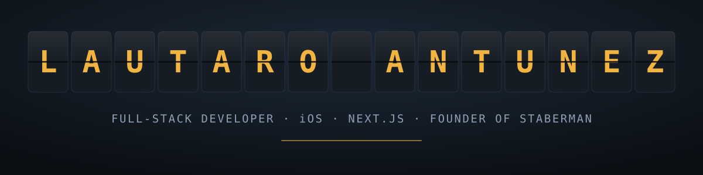

  

  
  

 

I build products end to end — architecture, code, infrastructure, and the store listing.

Founder of **[Staberman](https://staberman.com.ar)**, a one-person studio where I ship software for clients and my own products.

---

## Open source

Extracted from the products below — and the part of my work you can read, run and check without taking my word for it.

**[SplitFlap](https://github.com/Staberman/splitflap)** — mechanical split-flap departure board components for SwiftUI, extracted from Pomotti. Tiles flip, rows spell themselves out, and a `Canvas` fast path keeps a large board at frame rate. MIT.

**[ntag213-ndef](https://github.com/Staberman/ntag213-ndef)** — NDEF bytes that iOS background tag reading actually accepts, plus an NTAG213 lock verifier that reads page `02h` instead of the one that misleads you. Zero dependencies. MIT.

**[app-attest-gate](https://github.com/Staberman/app-attest-gate)** — the parts of Apple App Attest everyone hand-rolls wrong: single-use challenges, atomic replay protection, per-assertion environment pinning and request-body binding, paired with StoreKit 2 entitlements and a server-metered free tier. MIT.

**[AppAttestClient](https://github.com/Staberman/app-attest-client)** — the Swift half: a Secure Enclave request signer whose concurrent registrations collapse into one, so a fresh install cannot race itself into a 401. MIT.

---

## What I build

**📱 iOS & macOS**
Three apps built solo and submitted to the App Store — a Pomodoro timer styled as a split-flap departure board (SwiftUI, iOS + iPadOS + macOS), a mind-dump journaling app with an AI backend (SwiftUI), and a personal expense tracker with native StoreKit 2 subscriptions (React Native / Expo).

**🏗️ Multitenant SaaS**
A marketing analytics panel on Next.js 16 and self-hosted Supabase: row-level security across a five-role tenant hierarchy, batched ingestion that collapsed **9,000 API calls into 18**, cron-driven alerting, and **1,229 passing tests**.

**⚡ Commerce & automation**
Digital storefronts running in production with paid acquisition on Meta, a WhatsApp sales bot with its own CRM, and an outbound prospecting pipeline that has worked **700+ leads** unattended.

**🧾 Client work**
An offline-first point-of-sale PWA for a restaurant, built to keep taking orders when the network drops.

---

## Stack

  
  
  
  
  

  
  
  
  
  

  
  
  
  

I work in **hexagonal** and **screaming architecture**, with tests that describe behavior instead of implementation. Most of what I build is meant to be maintained for years, not demoed once.

---

## How I work

> **Specs before code.** Every non-trivial change starts as a written spec, a design, and a task list — then gets implemented and verified against them.

> **Review is a gate, not a ritual.** Nothing reaches a commit without passing an adversarial review pass.

> **Production is the only real test.** I run my own infrastructure, so I find out what breaks before a client does.

---

Most of my repositories are private — they hold client work, live commercial products, or personal data. Happy to walk through any of it on a call.

  

<a href="mailto:lautaro@staberman.com.ar"><b>lautaro@staberman.com.ar</b></a> · <a href="https://staberman.com.ar"><b>staberman.com.ar</b></a>

